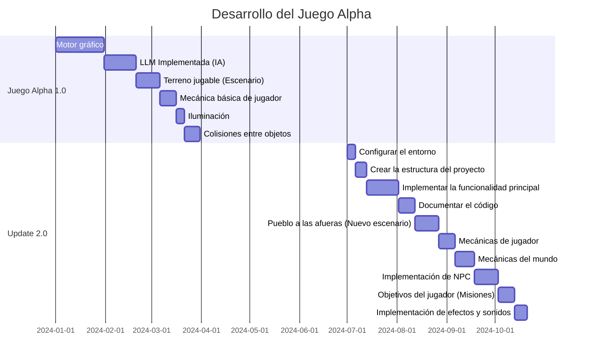

[Nuestra web](https://beta-web-llm.netlify.app/index.html)

**Integrantes actuales**
---------------
- Félix Francisco Canosa
- Tiziano Aguilar
- Carlos Gomes


**¿De qué trata?**
=====================

**Pantallazo general**
--------------------

Un juego (programa) educativo, sostenible y que concientiza el cuidado de la naturaleza a través del interativo diálogo generado por IAs (MLL) y el motor gráfico Godot Engine para sostener la arquitectura y lógica del juego.

**Premisa del juego**
--------------------

La premisa sería que el protagonista (un ser no-humano, hecho de hojas y madera), nace en un bosque milenario producto de la deforestación de los humanos, siendo su misión principal solucionar el problema de la deforestación.


## Diagrama de Gantt del Desarrollo



# Registro de Actualizaciones del Proyecto en mas

## 2024

### Agosto

#### 25 de agosto de 2024 (4 horas de implementación)

- 🎮 Nuevo prototipo del juego de Godot exportado directamente en la web
  - Etapa muy temprana de desarrollo
  - Exportado para funcionar en navegadores web
  

- 📝 Inicio de la documentación del proceso de desarrollo
  - Este medio se utilizará para documentar todo el proceso de creación y evolución del juego


---

Última actualización: 30 de mayo de 2023


```
Beta-programa

├─ ASITENTE
│  └─ asistente.html
├─ General
│  ├─ general.css
│  └─ general.html
├─ README.md
├─ Registro
│  ├─ registro.css
│  └─ registro.html
├─ Scritps
├─ contacto
│  ├─ contacto.css
│  └─ contacto.html
├─ estilo.css
├─ header_Footer_Global
│  ├─ header_Footer.js
│  └─ header_footer.css
├─ imagenes index
│  ├─ Captura de pantalla de 2024-08-03 22-45-32.png
│  ├─ Captura de pantalla de 2024-08-03 22-45-32.png.import
│  ├─ Designer.png
│  ├─ Designer.png.import
│  ├─ heroe.png
│  └─ heroe.png.import
└─ index.html

```